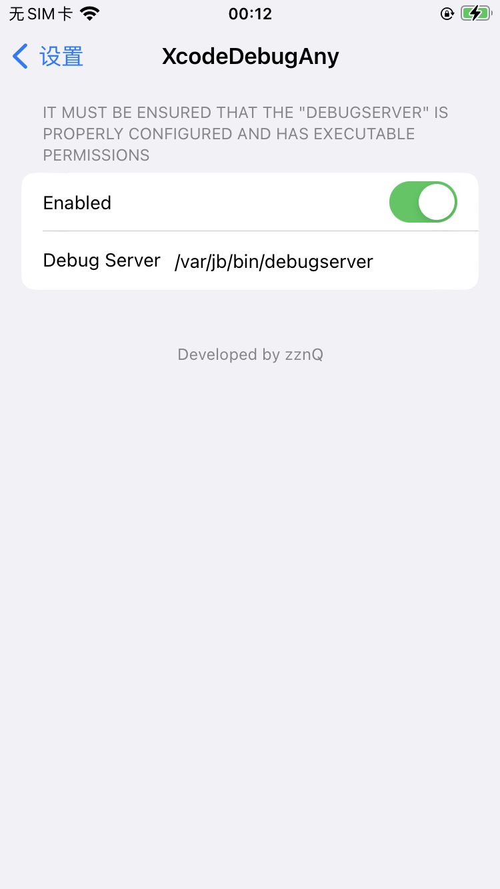

# XcodeDebugAny 

It can be easilier debug any process under rootless using Xcode.

## Preview

## How to use

1. Configure `debugserver` to add some permissions.(Refer [here](https://github.com/BreakOnCrash/AppleKits/tree/main/debugserver))
2. Upload `debugserver` to your device and set the path in `XcodeDebugAnyPrefs`.
3. Debug any process using Xcode :)

**tip**
This tweak depends on `preferenceloader` installed here: https://repo.palera.in/

## Credits / Thanks
[XcodeRootDebug](https://github.com/lemon4ex/XcodeRootDebug) by h4ck1n
